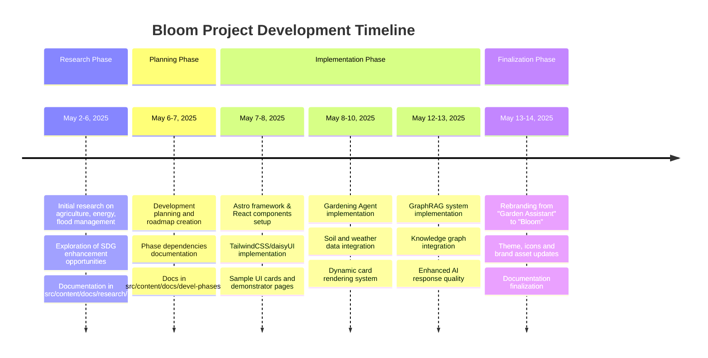

# Bloom - AI Gardening Assistant


Bloom is an interactive AI-powered gardening assistant designed specifically for Irish gardeners. It helps users select suitable plants, implement sustainable gardening practices, and access personalized advice based on their local conditions.

**Live Demo:** [https://irish-gardening.netlify.app/](https://irish-gardening.netlify.app/)

## 🌱 Main Features

### AI Gardening Assistant

The core of Bloom is the conversational AI assistant that provides:

- Natural language interactions for gardening advice
- Personalized plant recommendations based on user conditions
- Seasonal planting guidance with climate considerations
- Sustainable gardening practices tailored to Irish environments
- Troubleshooting help for common gardening problems

### Demonstrator Features

Bloom includes several specialized modules:

- **Weather & Soil Integration**: Real-time weather data and soil information for Irish counties
- **Plant Recommendation Engine**: Smart plant suggestions based on location, soil type, and garden conditions
- **Seasonal Garden Planner**: Monthly task calendar and seasonal overview for year-round gardening
- **Sustainability Tracker**: Tools to measure and improve the environmental impact of garden practices
- **GraphRAG Knowledge System**: Graph-based retrieval augmented generation for highly accurate gardening information

## 🛠️ Architecture

Bloom is built with a modern web technology stack:

- **Frontend**: Astro framework with React components and TailwindCSS/daisyUI
- **AI Integration**: Unified client supporting multiple AI providers (OpenAI and Google Vertex AI)
- **Data Storage**: Structured gardening knowledge in GraphRAG system
- **API Layer**: Serverless functions for weather data, plant recommendations, and AI interactions

```
Architecture Overview:
┌───────────────┐     ┌───────────────┐     ┌───────────────┐
│  Web Frontend │────▶│   API Layer   │────▶│  AI Services  │
└───────────────┘     └───────────────┘     └───────────────┘
        │                     │                     │
        │                     │                     │
        ▼                     ▼                     ▼
┌───────────────┐     ┌───────────────┐     ┌───────────────┐
│  UI Components│     │ Data Services │     │ Knowledge Base│
└───────────────┘     └───────────────┘     └───────────────┘
```

## 🌍 Deployment

Bloom is deployed on Netlify and available at:
[https://irish-gardening.netlify.app/](https://irish-gardening.netlify.app/)

## 📚 Documentation

For detailed information about the project, including

1. [Getting started](https://irish-gardening.netlify.app/docs/)
2. [Architecture](https://irish-gardening.netlify.app/docs/arch/01-architecture-overview)
3. [Development phases](https://irish-gardening.netlify.app/docs/devel-phases/phase-dependencies)

## 📅 Project Timeline



## 💚 Sustainability Focus

Bloom promotes sustainable gardening practices by:

- Encouraging native plant selection
- Providing water conservation guidance
- Offering biodiversity enhancement advice
- Measuring environmental impact of gardening choices
- Supporting sustainable food production
